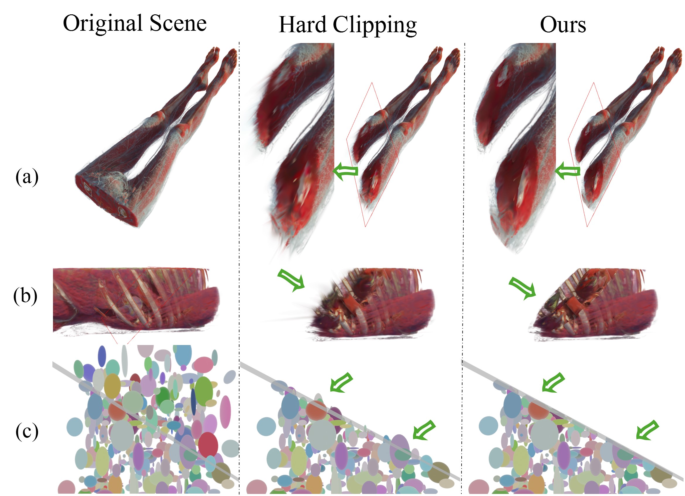

# RaRa Clipper: A Clipper for Gaussian Splatting Based on Ray Tracer and Rasterizer

<p align="center">
  
  <br>
  <em>RaRaClipper Teaser</em>
</p>

## About | 关于

**English:** Official open-source implementation of "RaRa Clipper: A Clipper for Gaussian Splatting Based on Ray Tracer and Rasterizer", featuring an advanced clipping plane system for interactive 3D Gaussian Splatting visualization.

**中文：** "RaRa Clipper: 基于光线追踪器和光栅化器的高斯点云裁剪器"的官方开源实现，提供先进的裁剪平面系统，用于交互式 3D 高斯点云可视化。

---

## 📄 Related Paper | 相关论文

**RaRa Clipper: A Clipper for Gaussian Splatting Based on Ray Tracer and Rasterizer**
- **Conference:** SIGGRAPH AISA2025 / ACM Transactions on Graphics
- **Authors:** Da Li, Donggang Jia, Yousef Rajeh, Dominik Engel, Ivan Viola
- **DOI:** [10.1145/3757377.3763982](https://dl.acm.org/doi/full/10.1145/3757377.3763982)
- **Paper PDF:** [ARXIV](https://arxiv.org/abs/2506.20202)

---

## 🖳 Related project
**EVSplitting : An Efficient and Visually Consistent Splitting Algorithm for 3D Gaussian Splatting**
- project code: https://github.com/LarkLeeOnePiece/EV-Splitting

## 🔗 Based on | 基于

This project builds upon excellent prior work:

- **[Splatviz](https://github.com/Florian-Barthel/splatviz)** - Interactive 3D Gaussian Splatting Viewer by Florian Barthel
- **[Multi-layer Gaussian Paper](https://hex-lab.io/Multi-Layer-Gaussian-Splatting-for-Immersive-Anatomy-Visualization/)** - Multi-layer Gaussian data representation, you can get some multi-layer Gaussian data from this project.

---

## ✨ Key Features | 核心特性

- 🎯 **Plane Clipping** - Advanced clipping plane system with interactive editing
- ⚡ **Dual Clipping Strategies** - RR Strategy (3x scale threshold) and 1D GS Strategy
- 🎨 **Interactive GUI** - Real-time visualization with ImGui-based controls
- 🔧 **Modified CUDA Rasterizer** - Custom diff-gaussian-rasterization with clipping logic

---


---

## 🚀 Quick Start | 快速开始

```bash
# Install dependencies
Please follow splatviz to install the environment. 

# Build CUDA extensions, install our rara-c;ipper patch code
cd gaussian-splatting/submodules/diff-gaussian-rasterization && pip install -e .
cd ../simple-knn && pip install -e .
cd ../../..

# Run the application
python run_main.py --data_path=/path/to/your/ply/files
```

For detailed installation instructions, please see the full documentation in your preferred language above.

---

## 🛠️ System Requirements(based on our test) | 系统要求

| Requirement | Minimum | Recommended |
|-------------|---------|-------------|
| **OS** | Windows / Linux | Windows / Linux |
| **GPU** | NVIDIA GPU (Compute Capability ≥ 7.0) | RTX 3000/4000 series+ |
| **CUDA** | 11.0 | 11.8 or 12.1 |
| **Python** | 3.8 | 3.8 - 3.10 |

---

## 🙏 Acknowledgements | 致谢

This project builds upon:

- **[Splatviz](https://github.com/Florian-Barthel/splatviz)** - Interactive viewer framework
- **[3D Gaussian Splatting](https://github.com/graphdeco-inria/gaussian-splatting)** - Original implementation by INRIA GRAPHDECO

---

## 📄 License | 许可证

This project is based on Gaussian Splatting, which is licensed for **non-commercial research and evaluation use only**. See [gaussian-splatting/LICENSE.md](gaussian-splatting/LICENSE.md) for details.

本项目基于 Gaussian Splatting，仅供**非商业研究和评估使用**。详见 [gaussian-splatting/LICENSE.md](gaussian-splatting/LICENSE.md)。

For commercial licensing inquiries, please contact us and the original 3DGS paper authors.
---

## 📧 Citation | 引用

If you find this work useful, please cite our paper:

```bibtex
[PLACEHOLDER: Add BibTeX citation]
@inproceedings{li2025rara,
  title={RaRa Clipper: A Clipper for Gaussian Splatting Based on Ray Tracer and Rasterizer},
  author={Li, Da and Jia, Donggang and Rajeh, Yousef and Engel, Dominik and Viola, Ivan},
  booktitle={Proceedings of the SIGGRAPH Asia 2025 Conference Papers},
  pages={1--10},
  year={2025}
}
```

---

## 📧 Contact | 联系方式

- **For implementation issues:** Open an issue on GitHub

---

<p align="center">
  ⭐ If you find this useful, please star the repository!
  <br>
  如果您觉得这个项目有用，请给我们一个星标！
</p>
